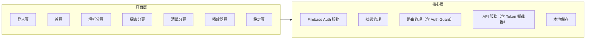
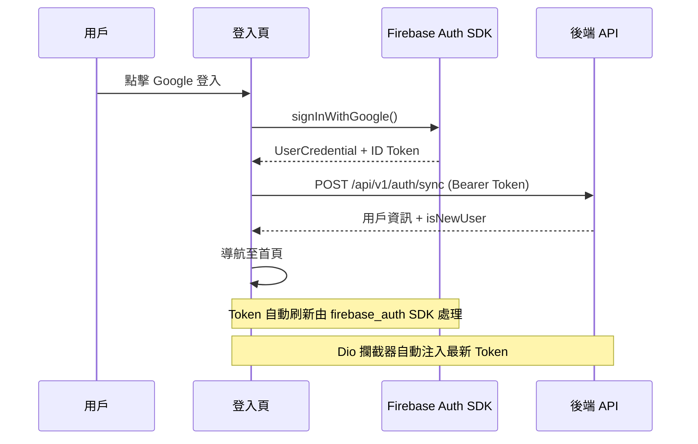

# 音樂記憶 — 前端技術架構設計

| 屬性 | 值 |
|------|-----|
| 作者 | Music Memory Team |
| 日期 | 2026-04-16 |
| 狀態 | 草稿 |
| 版本 | v1.0 |

## 背景

定義音樂記憶 Flutter 前端的技術選型、模組劃分與專案結構。

## 技術選型

| 技術 | 用途 | 說明 |
|------|------|------|
| Flutter 3.x | 跨平台 UI 框架 | 同時支援 iOS / Android / Web |
| firebase_auth | Firebase 認證 SDK | 處理 OAuth 登入、Token 管理、自動刷新 |
| google_sign_in | Google OAuth | Google 帳號登入整合 |
| sign_in_with_apple | Apple Sign-In | Apple 帳號登入整合 |
| flutter_facebook_auth | Facebook OAuth | Facebook 帳號登入整合 |
| Riverpod | 狀態管理 | 推薦用於複雜狀態管理場景 |
| go_router | 路由管理 | 支援深度連結與 Web 路由，含 Auth Guard |
| Dio | HTTP 客戶端 | 攔截器自動注入 Firebase ID Token |
| flutter_swiper | 卡片滑動 | 實現類似交友軟體的滑動互動 |
| just_audio | 音訊播放 | 支援背景播放、鎖屏控制 |
| Hive / Isar | 本地資料庫 | 離線快取與本地數據 |

## 模組劃分



## 專案結構

```
music_memory_ui/
├── lib/
│   ├── main.dart
│   ├── app/
│   │   ├── app.dart                    # App 根元件
│   │   └── router.dart                 # 路由配置（含 Auth Guard）
│   ├── config/
│   │   └── firebase_config.dart        # Firebase 初始化
│   ├── features/
│   │   ├── auth/                       # 認證模組
│   │   │   ├── pages/
│   │   │   │   └── login_page.dart
│   │   │   ├── providers/
│   │   │   │   └── auth_provider.dart
│   │   │   └── services/
│   │   │       └── firebase_auth_service.dart
│   │   ├── home/                       # 首頁
│   │   ├── parse/                      # YouTube 解析
│   │   ├── explore/                    # AI 探索（滑動卡片）
│   │   ├── playlist/                   # 清單管理
│   │   ├── player/                     # 播放器
│   │   ├── lyrics/                     # 歌詞（含漂浮視窗）
│   │   ├── download/                   # 下載備份
│   │   └── settings/                   # 設定
│   ├── core/
│   │   ├── api/
│   │   │   ├── api_client.dart         # Dio 客戶端（含 Token 攔截器）
│   │   │   └── api_endpoints.dart
│   │   ├── models/                     # 共用資料模型
│   │   ├── providers/                  # 全域 Provider
│   │   ├── utils/                      # 工具類
│   │   └── widgets/                    # 共用元件
│   └── l10n/                           # 國際化
├── assets/
│   ├── images/
│   └── fonts/
├── test/
├── android/
├── ios/
├── web/
└── pubspec.yaml
```

## 認證流程（前端）



## API 攔截器設計

```dart
// Dio 攔截器自動注入 Firebase ID Token
class FirebaseTokenInterceptor extends Interceptor {
  @override
  Future<void> onRequest(options, handler) async {
    final user = FirebaseAuth.instance.currentUser;
    if (user != null) {
      final token = await user.getIdToken();
      options.headers['Authorization'] = 'Bearer $token';
    }
    handler.next(options);
  }
}
```

## 路由守衛設計

```dart
// go_router redirect 驗證登入狀態
GoRouter(
  redirect: (context, state) {
    final isLoggedIn = FirebaseAuth.instance.currentUser != null;
    final isLoginRoute = state.matchedLocation == '/login';

    if (!isLoggedIn && !isLoginRoute) return '/login';
    if (isLoggedIn && isLoginRoute) return '/';
    return null;
  },
)
```

---

## 參考

- [Notion 技術架構設計](https://www.notion.so/34495a2a16f781e39791c09d0c157fcd)
- [Notion 使用者故事與流程圖](https://www.notion.so/34495a2a16f7814dbab6ce569ec5b9d2)
