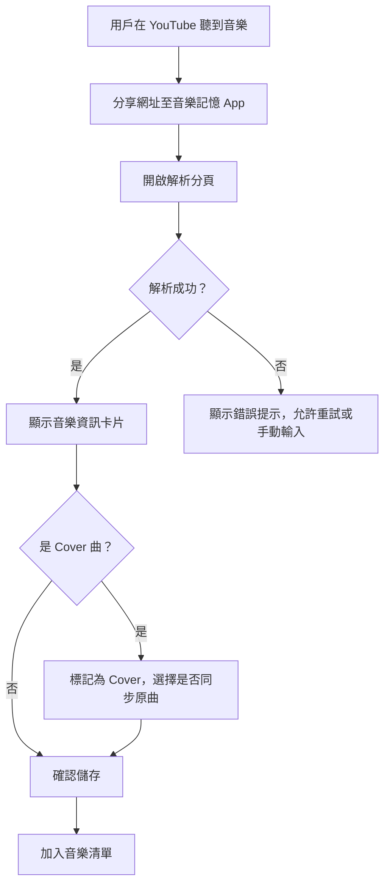
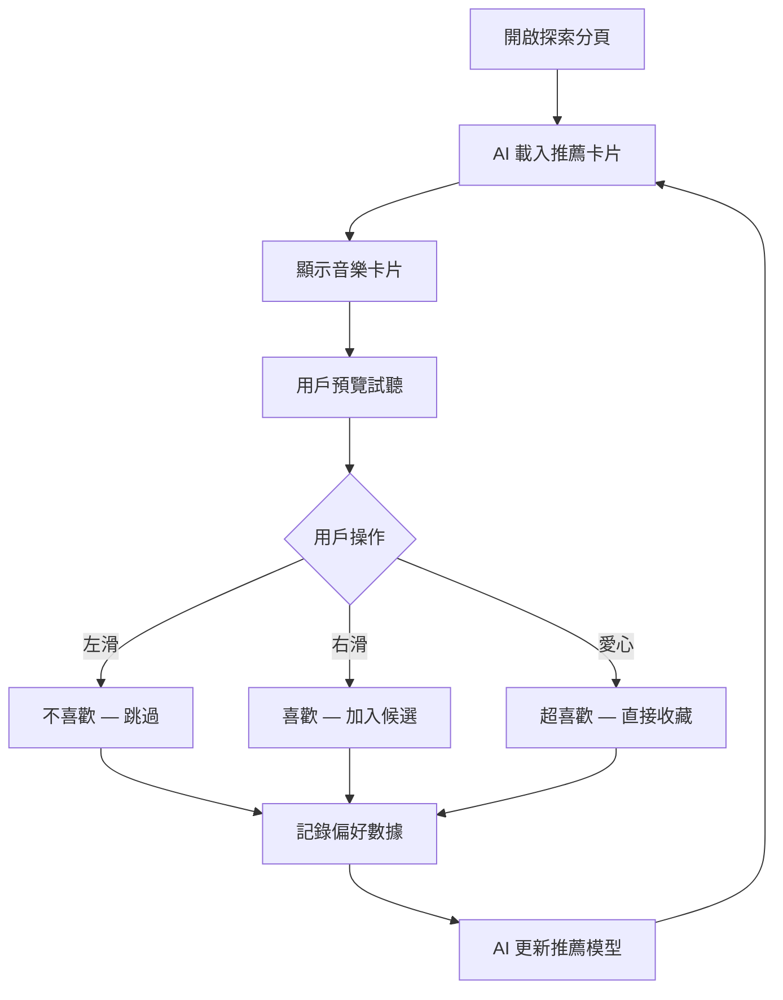

# 音樂記憶 — 使用者故事與流程

| 屬性 | 值 |
|------|-----|
| 作者 | Music Memory Team |
| 日期 | 2026-04-16 |
| 狀態 | 草稿 |
| 版本 | v1.0 |

## 背景

定義音樂記憶前端的核心使用者故事，用於引導 UI/UX 設計與開發驗收。

---

## US-00：OAuth 登入

> **作為**一個新用戶，**我希望**能透過 Google / Apple / Facebook 帳號快速登入，**以便於**我不用記額外的帳號密碼就能開始使用。

**情境：**
1. 我開啟 App，看到登入頁面
2. 登入頁面清楚展示 Google、Apple、Facebook 登入按鈕
3. 我點擊「以 Google 登入」
4. 系統跳轉至 Google 授權頁面
5. 授權完成後自動返回 App
6. 系統自動建立帳號並導航至首頁

## US-01：分享 YouTube 音樂網址

> **作為**一個音樂愛好者，**我希望**能夠直接從 YouTube 分享音樂網址到 App，**以便於**快速收藏和管理我喜歡的音樂。

**情境：**
1. 我在 YouTube 聽到一首喜歡的歌
2. 點擊 YouTube 的分享按鈕
3. 選擇「音樂記憶」App
4. App 自動開啟解析分頁並顯示解析結果
5. 我確認資訊無誤後點擊「儲存」

## US-02：網址解析與編輯

> **作為**一個用戶，**我希望**能在專用分頁中貼上 YouTube 網址並查看解析結果，**以便於**我可以確認和修改音樂資訊。

**情境：**
1. 我開啟 App 的解析分頁
2. 貼上 YouTube 網址
3. 系統顯示解析結果卡片（封面、歌名、演出者、時長）
4. 如果資訊不完整，我可以手動編輯
5. 如果是 Cover 曲，我可以標記並選擇是否同步原曲

## US-03：AI 音樂探索（滑動互動）

> **作為**一個想探索新音樂的用戶，**我希望**能透過滑動卡片的方式試聽和篩選音樂，**以便於**我用輕鬆有趣的方式發現喜歡的音樂。

**情境：**
1. 我開啟 App 的探索分頁
2. 看到一張卡片顯示推薦音樂的封面和資訊
3. 點擊播放按鈕預覽試聽
4. 喜歡 → 右滑（加入候選）
5. 不喜歡 → 左滑（跳過）
6. 超愛 → 點愛心（直接收藏）
7. 下一張卡片自動出現

## US-04：音樂清單管理與分類

> **作為**一個收藏了大量音樂的用戶，**我希望**能按照不同維度排序和篩選我的音樂，**以便於**快速找到我想聽的歌。

**情境：**
1. 我開啟清單分頁
2. 看到所有已收藏音樂列表
3. 點擊排序按鈕選擇「聽歌次數」
4. 切換篩選器只顯示「非原曲 (Cover)」
5. 搜尋歌名或演出者快速定位

## US-05：下載與雲端備份

> **作為**一個擔心音樂連結失效的用戶，**我希望**能下載音樂到本地或備份到雲端，**以便於**隨時離線聽歌且不用擔心損失。

**情境：**
1. 我在清單中選擇一首或多首音樂
2. 點擊「下載」按鈕
3. 選擇儲存位置（本地 / Google Drive / iCloud）
4. 看到下載進度條
5. 下載完成後可離線播放

## US-06：LRC 歌詞與漂浮顯示

> **作為**一個喜歡看歌詞的用戶，**我希望**能在聽歌時看到同步歌詞，甚至在切換到其他 App 時也能看到，**以便於**我可以跟著唱或學習歌詞。

**情境：**
1. 我正在播放一首歌
2. 點擊「歌詞」按鈕，全屏顯示同步歌詞
3. 開啟「漂浮歌詞」功能
4. 切換到其他 App（如 LINE）
5. 螢幕上方出現小型漂浮視窗，持續顯示當前歌詞

---

## 核心流程圖

### 分享解析流程

### AI 探索流程

---

## 參考

- [Notion 使用者故事與流程圖](https://www.notion.so/34495a2a16f7814dbab6ce569ec5b9d2)
